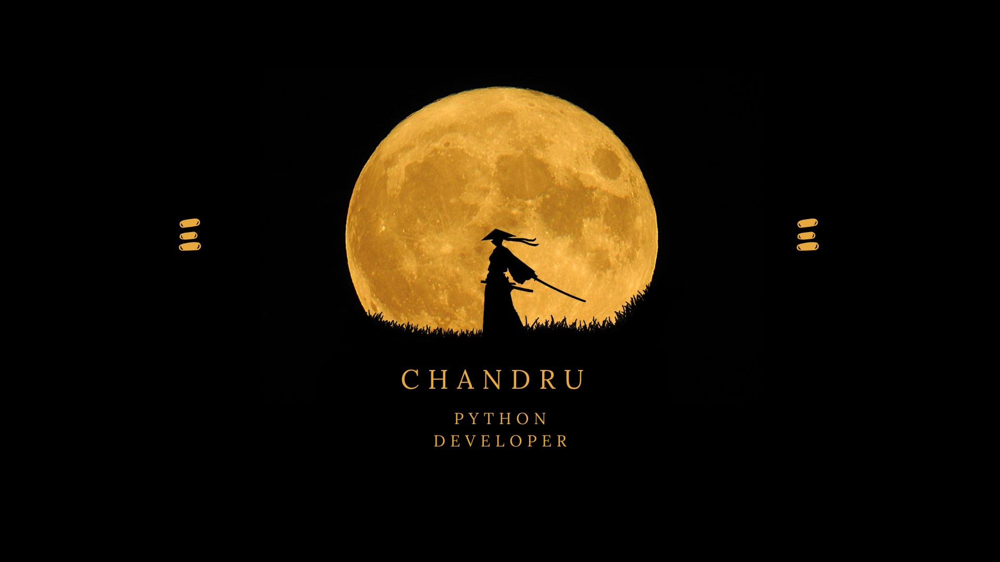

  

<h1 align="center">Hi there, I'm Chandru! 👋</h1>

  <em>🌱 Currently learning Django Framework | 🤔 Seeking help with DevOps | 😄 Pronouns: Chandru | ⚡ Fun Fact: Committed with Computers</em>

<h3 align="center">About Me</h3>

  Hello! I'm Chandru, and I'm passionate about exploring the vast world of technology. My journey involves constant learning, and currently, I'm diving into the intricacies of the Django Framework. With a commitment to excellence, I find joy in collaborating with computers and turning ideas into reality through code.

<h3 align="center">Get in Touch</h3>

  📫 Connect with me on LinkedIn: <a href="https://www.linkedin.com/in/chandru-gs/">Chandru on LinkedIn</a>

  Let's connect and embark on this exciting journey of knowledge and innovation together!

---

  <em>Feel free to explore, and happy coding! 🚀</em>

